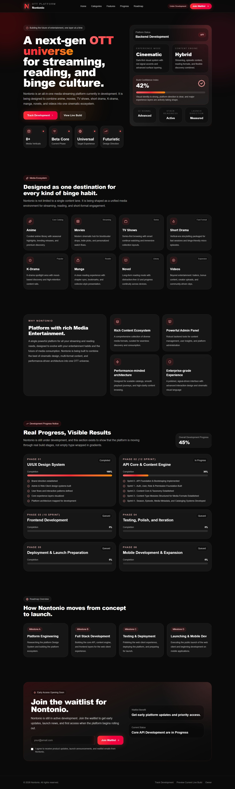

# Landing Page

Nontonio adalah platform media entertainment all-in-one yang berisi berbagai akses streaming hiburan. Platform ini di kembangkan oleh PT. Ardean Studio Enterprise (ASE, Inc) dan didirikan pada tahun 2026. Platform ini akan di luncurkan pada awal tahun 2027 oleh ASE, Inc.

## Preview Landing

## Fitur Platform

### Streaming

- Anime
- Movies
- TV Series
- Short Drama
- Manga
- Novel
- K-Drama
- Video

### Kapabilitas

- Multi-Bahasa
- Multi-Source Streaming
- Enterprise Level Admin Panel
- Sistem Monetisasi
- Multiple Business Model `AVOD`, `SVOD`, `TVOD`
- Video Studio → **Creator Panel**
- Partnership System → **Vendor Panel**
- Social System
    - Review / Comments
    - Chat System
- Watchlist & Playlist System
- Continue Watching & AI Recommendation System
- Multiple Integration
    - Google
    - Anilist
    - Sentry
    - AgeVerif
    - Google Vision
    - OpenSubtitles
    - Trakt
- Full-Whitelable
- Platform Mode Selection
- Encoding & Transcoding System
- DRM System for Media Content
- Multiple Object Storage
    - Local
    - FTP
    - Cloudflare R2
    - Amazon S3
    - Wasabi
    - BackBlaze
    - Google Cloud Storage
    - Digital Ocean Space
- API System

### Payment Options

- Auto-Detect User Currency
- Auto-Adjust User Location for preferred Payment Gateway
- Multiple Payment Gateway
    - Stripe
    - PayPal
    - Xendit
    - Midtrans
    - Coinbase
    - AliPay
    - Apple Pay

### Media Streaming

- Watch Parties
- Autoplay & Auto-Next Video Player
- Premium Content System
- Renting System

Dan masih banyak lagi fitur-fitur dari Platform Nontonio.

## Visi, Misi, & Value

### Visi

Menjadi sarana hiburan terpadu untuk berbagai jenis layanan.

### Misi

Menghubungkan semua sarana layanan menjadi satu platform untuk semua.

### Value

- Penyedia berbagai sarana hiburan
- Layanan yang dapat diandalkan untuk semua

## Informasi

### Perusahaan

PT. Ardean Studio Enterprise / ASE, Inc berlokasi di Kota Ternate, Maluku Utara, Indonesia. Telah Berdiri sejak 2020 dan telah beroperasi lebih dari 5+ tahun. ASE, Inc bergerak di bidang Teknologi Informasi, Perangkat Lunak, dan Layanan. Pendiri ASE, Inc ialah Ardean Bima Saputra.

### Kontak

- Email: ardeanstudio@gmail.com
- Telp: +62-812-3399-3988
- Web Owner: https://ardean.me
- Web Perusahaan: https://ardeanstudio.com